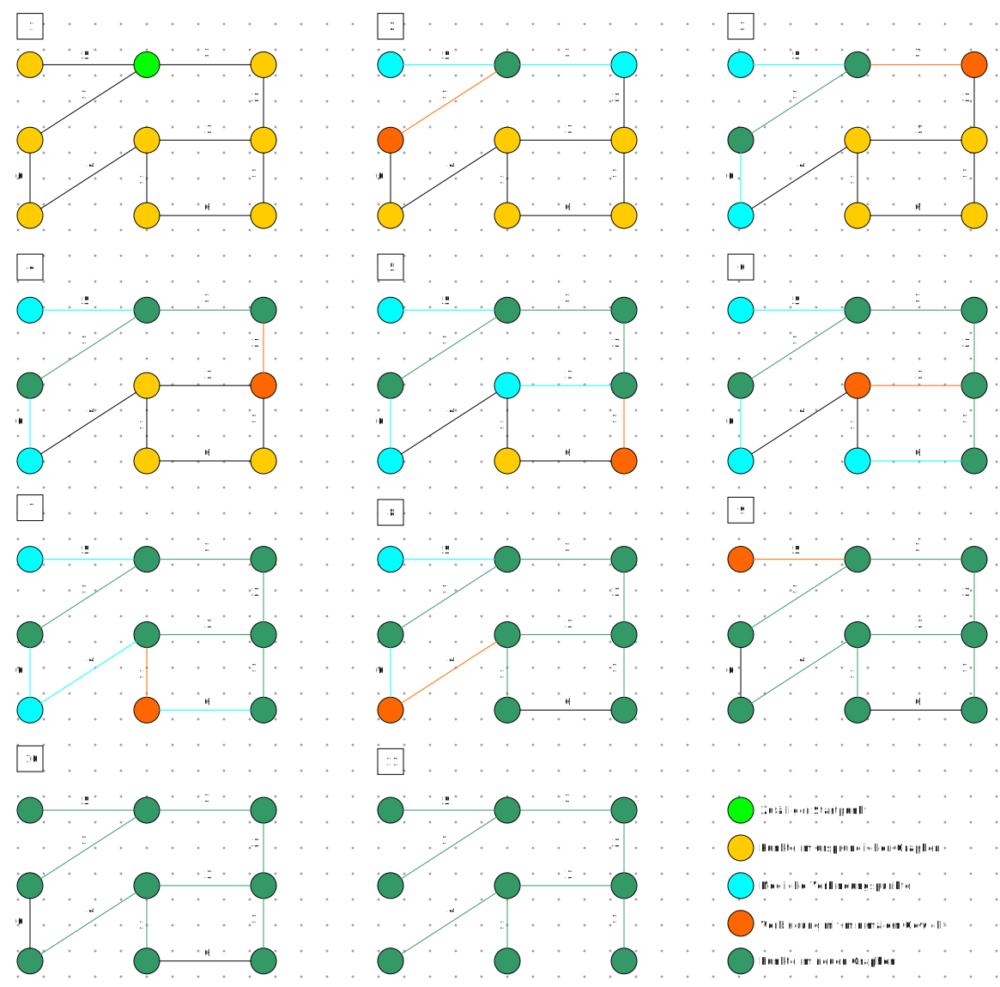

# Graphentheorie

- [Algorithmus von Prim](#algorithmus-von-prim)
- [Algorithmus von Hierholzer](#algorithmus-von-hierholzer)
- [Algorithmus von Djikstra](#algorithmus-von-djikstra)

## Algorithmus von Prim

1930 vom tschechischen Mathematiker Vojtěch Jarník entwickelt,
1957 von Robert C. Prim wiederentdeckt und
1959 von Edsger W. Dijkstra wiederentdeckt.

Andere Namen: *Prim-Dijkstra-Algorithmus*, *Algorithmus von Jarnik*, *Prim und Dijkstra*, *Jarnik’s algorithm* und *DJP algorithm*.

- [Welches Problem löst dieser Algorithmus?](#welches-problem-löst-der-algorithmus-von-prim)
- [Wie läuft er ab?](#wie-läuft-der-algorithmus-von-prim-ab)
- [Warum liefert er immer das korrekte Ergebnis?](#warum-liefert-der-algorithmus-von-prim-immer-das-korrekte-ergebnis)
- [Gibt es Einschränkungen hinsichtlich der Gültigkeit?](#gibt-es-einschränkungen-hinsichtlich-der-gültigkeit-des-algorithmus-von-prim)

### Welches Problem löst der Algorithmus von Prim?

Er findet den minimalen Spannbaum eines zusammenhängenden, ungerichteten, kantengewichteten Graphen.

### Wie läuft der Algorithmus von Prim ab?

1. Es wird ein zufälliger Knoten auf dem Graph ausgewählt.
2. Von diesem Knoten wird eine anliegende Kante mit minimalem Gewicht und der dazugehörige Knoten zum Graph hinzugefügt.
3. Anschliessend wird ein noch nicht erschlossener Knoten mit einer Verbindungskante mit minimalem Gewicht zum Graph hinzugefügt.
4. Schritt 3 wird wiederholt, bis alle Punkte erschlossen sind.

### Warum liefert der Algorithmus von Prim immer das korrekte Ergebnis?

Weil alle Knoten verbunden werden müssen und dazu immer der kürzeste Weg verwendet wird.

### Gibt es Einschränkungen hinsichtlich der Gültigkeit des Algorithmus von Prim?

Nein, es gibt keine Einschränkungen.

## Algorithmus von Hierholzer

- [Welches Problem löst dieser Algorithmus?](#welches-problem-löst-der-algorithmus-von-hierholzer)
- [Wie läuft er ab?](#wie-läuft-der-algorithmus-von-hierholzer-ab)
- [Warum liefert er immer das korrekte Ergebnis?](#warum-liefert-der-algorithmus-von-hierholzer-immer-das-korrekte-ergebnis)
- [Gibt es Einschränkungen hinsichtlich der Gültigkeit?](#gibt-es-einschränkungen-hinsichtlich-der-gültigkeit-des-algorithmus-von-hierholzer)

### Welches Problem löst der Algorithmus von Hierholzer?

Mit dem Algorithmus von Hierholzer können mögliche eulersche Wege gefunden werden. Der Graph darf dabei nur Knoten mit geradem Grad besitzen.

### Wie läuft der Algorithmus von Hierholzer ab?

\-

### Warum liefert der Algorithmus von Hierholzer immer das korrekte Ergebnis?

\-

### Gibt es Einschränkungen hinsichtlich der Gültigkeit des Algorithmus von Hierholzer?

\-

## Algorithmus von Djikstra

- [Welches Problem löst dieser Algorithmus?](#welches-problem-löst-der-algorithmus-von-djikstra)
- [Wie läuft er ab?](#wie-läuft-der-algorithmus-von-djikstra-ab)
- [Warum liefert wer immer das korrekte Ergebnis?](#warum-liefert-der-algorithmus-von-djikstra-immer-das-korrekte-ergebnis)
- [Gibt es Einschränkungen hinsichtlich der Gültigkeit?](#gibt-es-einschränkungen-hinsichtlich-der-gültigkeit-des-algorithmus-von-djikstra)

### Welches Problem löst der Algorithmus von Djikstra?

Er findet den kürzesten Pfad zwischen zwei gegebenen Punkten.

### Wie läuft der Algorithmus von Djikstra ab?

\-

### Warum liefert der Algorithmus von Djikstra immer das korrekte Ergebnis?

Bei jedem Knoten wird mit Sicherheit der kürzeste Weg zum Start gefunden.

### Gibt es Einschränkungen hinsichtlich der Gültigkeit des Algorithmus von Djikstra?

Der Graph muss zusammenhängend sein und darf keine negativen Gewichtungen enthalten.
